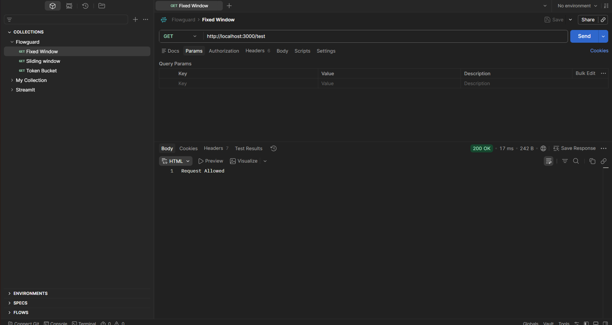
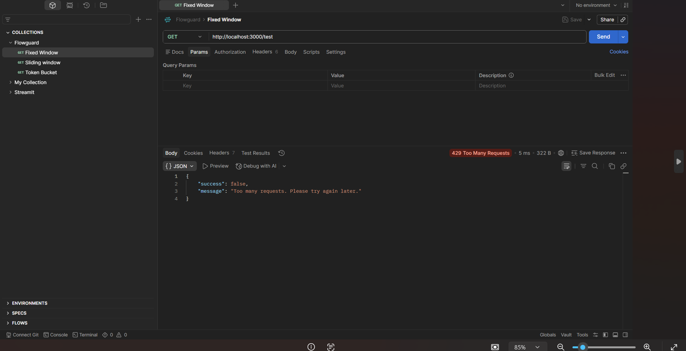
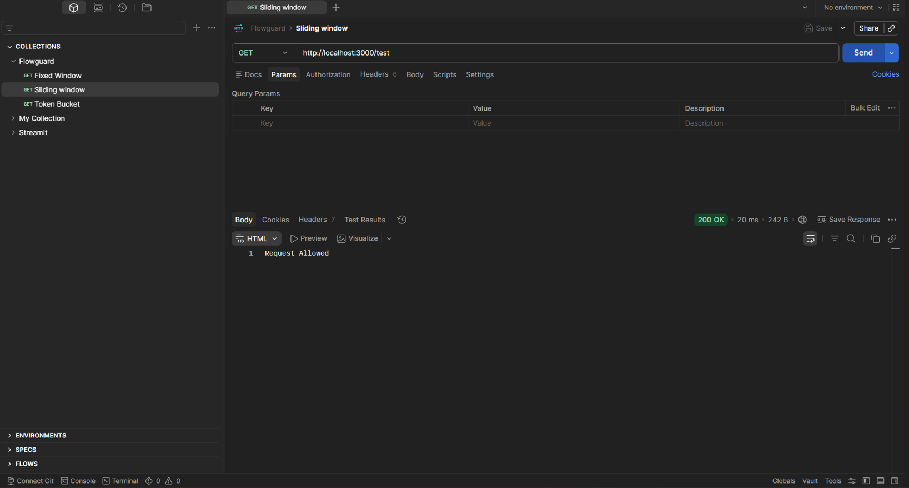
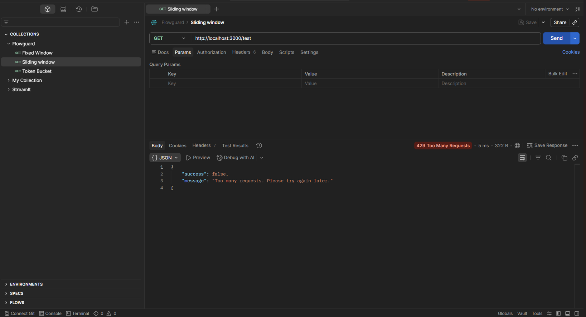
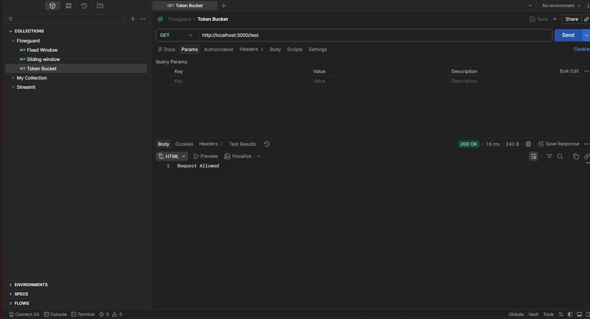
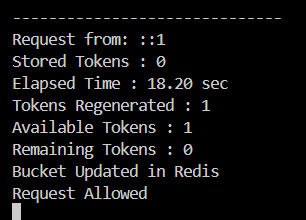

# FlowGuard

> **A production-inspired rate limiting middleware built with Express.js
> and Redis.**

FlowGuard is a backend infrastructure project that implements and
compares multiple rate limiting algorithms using Express.js and Redis.
Instead of focusing on a single implementation, the project explores how
different algorithms solve different traffic patterns, why they require
different Redis data structures, and what engineering trade-offs they
introduce.

<p align="center">
  
  
  
  
  
</p>

------------------------------------------------------------------------

## Overview

Rate limiting is one of the most widely used techniques for protecting
APIs against abuse, excessive traffic and denial-of-service attacks.
FlowGuard demonstrates this concept by progressively implementing
multiple algorithms instead of relying on a third-party library.

The project starts with a simple in-memory implementation and evolves
into Redis-backed middleware, highlighting why production systems prefer
centralized storage, atomic operations and automatic expiration.

The emphasis throughout the project is understanding engineering
decisions rather than simply writing code.

------------------------------------------------------------------------

## Repository Highlights

-   Four rate limiting implementations (including the learning-oriented
    naive version)
-   Fixed Window, Sliding Window Log and Token Bucket algorithms
-   Three Redis data structures (String, Sorted Set and Hash)
-   Express middleware architecture
-   Dockerized Redis environment
-   Postman collection and testing screenshots
-   Engineering decision documentation

------------------------------------------------------------------------

## Features

-   Modular Express middleware
-   Redis-backed request tracking
-   Docker support
-   Clean project structure
-   Independent algorithm implementations
-   Easily switch between algorithms
-   Postman testing collection
-   Engineering-focused documentation

------------------------------------------------------------------------

## Architecture

``` text
              Client
                 │
                 ▼
          Express Server
                 │
                 ▼
     Rate Limiter Middleware
                 │
      ┌──────────┼──────────┐
      │          │          │
      ▼          ▼          ▼
 Fixed Window  Sliding Log  Token Bucket
      │          │          │
      └──────────┼──────────┘
                 │
                 ▼
               Redis
                 │
                 ▼
           Route Handler
                 │
                 ▼
             HTTP Response
```

Each algorithm is implemented as a standalone middleware. Switching
algorithms only requires changing a single middleware import.

------------------------------------------------------------------------

## Algorithms

  ------------------------------------------------------------------------
  Algorithm     Redis Structure       Main Strength       Typical Use
  ------------- --------------------- ------------------- ----------------
  Naive         JavaScript Object     Learning            Understand
  In-Memory                                               request counting

  Fixed Window  String                Fast and memory     Public APIs
                                      efficient           

  Sliding       Sorted Set            Accurate and fair   Authentication
  Window Log                                              APIs

  Token Bucket  Hash                  Allows controlled   Downloads &
                                      bursts              streaming
  ------------------------------------------------------------------------

------------------------------------------------------------------------

## Redis Data Structures

  -------------------------------------------------------------------------
  Structure                      Used By                     Why
  ------------------------------ --------------------------- --------------
  String                         Fixed Window                Atomic request
                                                             counter using
                                                             `INCR`

  Sorted Set                     Sliding Window Log          Stores
                                                             timestamps for
                                                             rolling window
                                                             calculations

  Hash                           Token Bucket                Stores
                                                             `tokens` and
                                                             `lastRefill`
                                                             together
  -------------------------------------------------------------------------

Each algorithm uses the Redis structure that naturally matches its
storage requirements.

------------------------------------------------------------------------

## Project Structure

``` text
FlowGuard/
├── assets/
├── docs/
├── postman/
├── src/
│   ├── config/
│   ├── middleware/
│   ├── routes/
│   ├── app.js
│   └── server.js
├── package.json
└── README.md
```

------------------------------------------------------------------------

## Technology Stack

-   Node.js
-   Express.js
-   Redis
-   ioredis
-   Docker
-   Postman
-   Git & GitHub

------------------------------------------------------------------------

## Getting Started

### Prerequisites

-   Node.js
-   Docker Desktop
-   Git

### Installation

``` bash
git clone https://github.com/Raghav-RB/FlowGuard.git
cd Flowguard
npm install
```

Start Redis:

``` bash
docker run -d --name redis-server -p 6379:6379 redis
# later
docker start redis-server
```

Run the application:

``` bash
npm start
```

Server:

``` text
http://localhost:3000
```

------------------------------------------------------------------------

## Switching Algorithms

Select the middleware you want inside `src/app.js`.

``` javascript
const rateLimiter = require("./middleware/fixedWindowRateLimiter");
// or
const rateLimiter = require("./middleware/slidingWindowRateLimiter");
// or
const rateLimiter = require("./middleware/tokenBucketRateLimiter");
```

------------------------------------------------------------------------

## API

  Method   Endpoint   Description
  -------- ---------- ---------------------------------------------------
  GET      `/test`    Sends a request through the configured middleware

------------------------------------------------------------------------

## Testing

The project was manually tested using Postman.

The repository includes:

-   Fixed Window success & limit tests
-   Sliding Window success & limit tests
-   Token Bucket success
-   Token refill demonstration

Import:

``` text
postman/FlowGuard.postman_collection.json
```

### Fixed Window





### Sliding Window Log





### Token Bucket





------------------------------------------------------------------------

## Engineering Decisions

### Why Redis?

The initial implementation stored request counts in memory. While
suitable for learning, this approach loses data on restart and cannot
share state across multiple application instances.

Redis provides centralized storage, automatic key expiration through TTL
and atomic operations such as `INCR`, making it a better fit for
production-style rate limiting.

### Why different Redis data structures?

Each algorithm has different storage requirements.

-   Fixed Window only needs one counter.
-   Sliding Window Log stores request timestamps.
-   Token Bucket stores both token count and refill time.

Choosing the right Redis structure simplifies the implementation and
improves efficiency.

### Fixed Window Boundary Problem

Fixed Window can allow requests at the end of one window and the
beginning of the next, allowing nearly double the configured limit over
a short period.

Sliding Window Log removes this limitation by counting requests over a
continuously moving window.

### Redis Failure

The middleware catches Redis-related errors and returns an HTTP 500
response.

In a production system, the design decision would be whether to
fail-open (prioritize availability) or fail-closed (prioritize
security), depending on the application's requirements.

------------------------------------------------------------------------

## Future Improvements

-   Add automated tests using Jest and Supertest
-   Read configuration from environment variables
-   Support user ID and API key based limiting
-   Support Redis Cluster deployments
-   Publish FlowGuard as an npm package

------------------------------------------------------------------------

## Author

**Rahul**

GitHub: https://github.com/rahul0049

Repository: https://github.com/rahul0049/rate-limiter